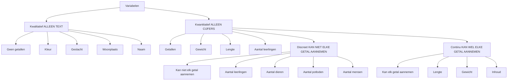
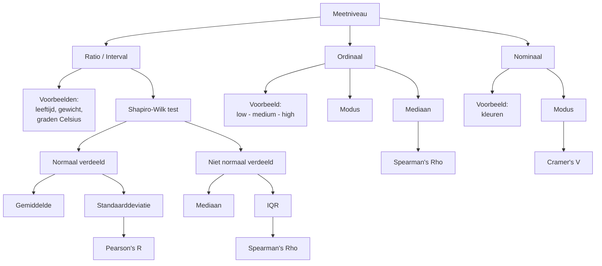

# Variabelen en meetniveaus

[[./index]]
[[./verdelingen-en-kurtosis]]

## Variabelen

## Meetniveau's

### Nominaal

categorien ZONDER vaste volgorde

- `kleuren`
- `geslacht`
- `diersoorten`

### Ordinaal

categorien MET volgorde, MAAR stapgrootte is niet overal hetzelfde

- `kledingmaten`
- `film-ratings`
- `decibel`

### Interval

VASTE volgorde met dezelfde stapgrootte, maar geen natuurlijk nulpunt

- wilt zeggen dat het aantal in de min kan, bijvoorbeeld `-1`
- `jaartelling`
- `temperatuur` *Fahrenheit & Celsius*

### Ratio

vaste volgorde, stapgrootte allemaal hetzelfde, natuurlijk nulpunt

- wilt zeggen dat het aantal `0` is
- `examen punten`
- `leeftijd`
- `batterij-percentage`

## Overzicht

## 1. Meetniveau

### Ratio / Interval

* Voorbeelden:

  * leeftijd
  * gewicht
  * graden Celsius

#### Als de data normaal verdeeld is
* welke tekst moet je gebruiken voor om te kijken als de data normaal verdeeld is?
  * shapiro-wilk test
* gebruik:

  * gemiddelde
  * standaarddeviatie

* correlatie:

  * Pearson's R

#### Als de data niet normaal verdeeld is
* welke tekst moet je gebruiken voor om te kijken als de data normaal verdeeld of niet normaal verdeeld is?
  * shapiro-wilk test
* gebruik:

  * mediaan
  * IQR

* correlatie:

  * Spearman's Rho

---

### Ordinaal

* Voorbeeld:

  * low - medium - high

* gebruik:

  * modus
  * mediaan

* correlatie:

  * Spearman's Rho

---

### Nominaal

* Voorbeeld:

  * kleuren

* gebruik:

  * modus

* correlatie:

  * Cramer's V

