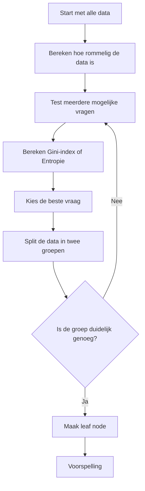
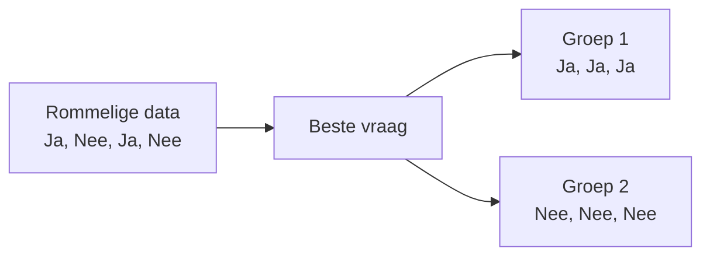
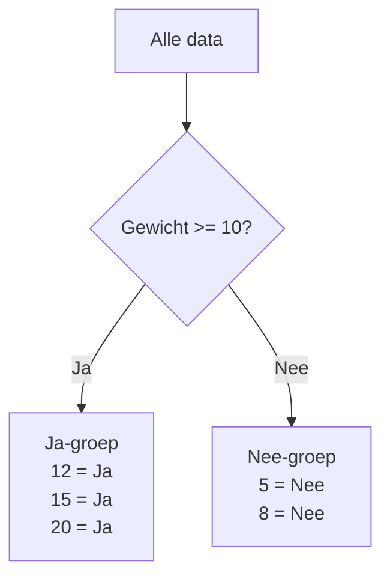
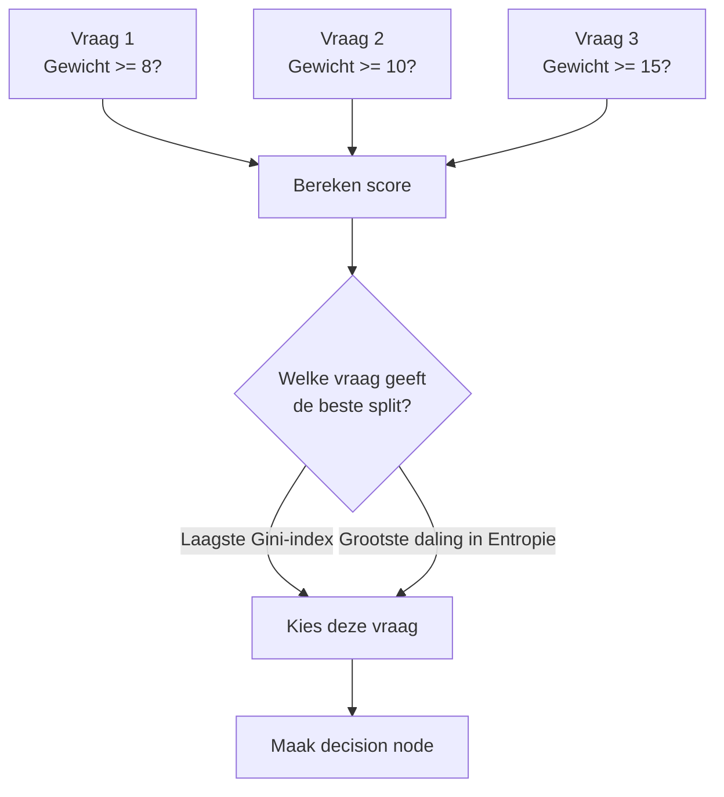
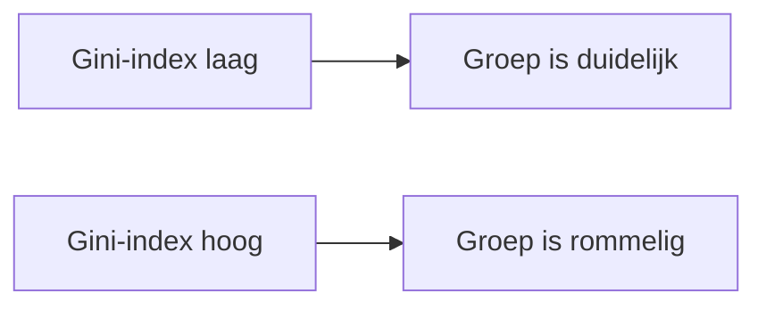
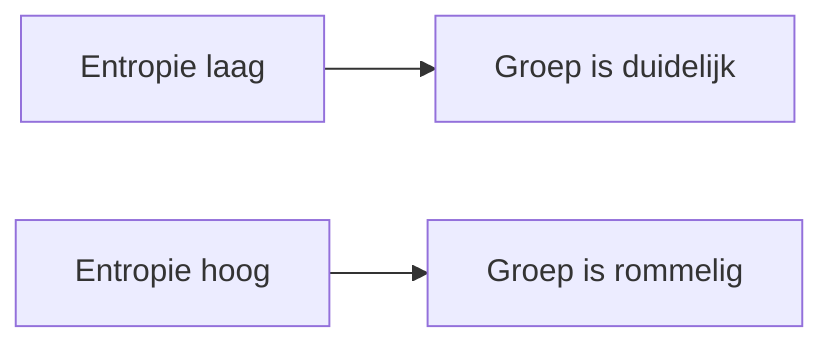
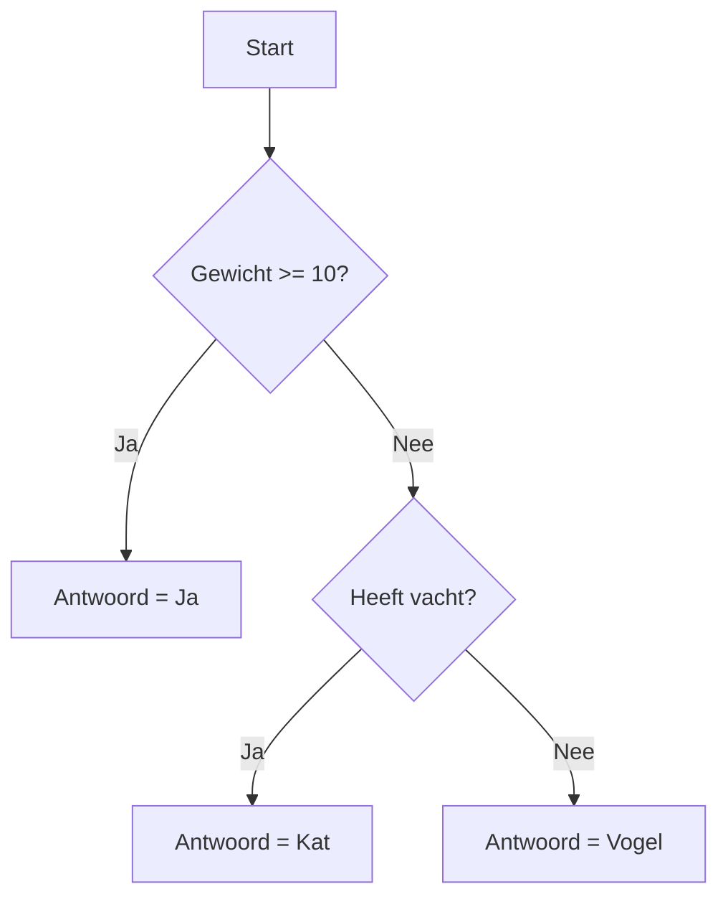
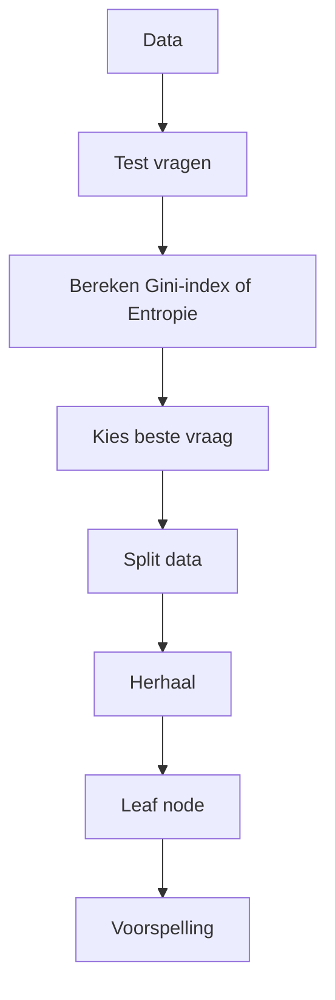

# Classificatiebeslissingsboom

Een classificatiebeslissingsboom is een algoritme dat steeds een **vraag** stelt.

Bijvoorbeeld:

> Is gewicht groter dan 10?

Daarna splitst de data in twee groepen:

```text
Ja-groep
Nee-groep
```

> De boom kiest de vraag **niet zelf zomaar**.   
> Hij berekent welke vraag het beste is met:
> *  **Gini-index**
> *  **Entropie**

---

# 1. Het algemene algoritme



## Uitleg

De boom begint met alle data.

Daarna kijkt hij:

```text
Hoe gemengd zijn de antwoorden?
```

Als de antwoorden nog rommelig zijn, gaat de boom verschillende vragen testen.

Voor elke vraag berekent hij of de data duidelijker wordt.

De beste vraag wordt gekozen.

Daarna splitst de boom de data in twee groepen.

Dit blijft doorgaan totdat de groep duidelijk genoeg is.

---

# 2. Wat probeert de boom te doen?

De boom wil dit veranderen:

```text
Ja, Nee, Ja, Nee, Ja, Nee
```

naar dit:

```text
Groep 1: Ja, Ja, Ja
Groep 2: Nee, Nee, Nee
```



## Uitleg

Aan het begin zitten de antwoorden door elkaar.

De boom zoekt een vraag waardoor de antwoorden beter gescheiden worden.

Een goede vraag zorgt ervoor dat in één groep vooral dezelfde antwoorden zitten.

Dus:

```text
rommelig → vraag stellen → duidelijkere groepen
```

---

# 3. Voorbeeld van een split

Stel je hebt deze data:

```text
Gewicht | Antwoord
5       | Nee
8       | Nee
12      | Ja
15      | Ja
20      | Ja
```

De boom test bijvoorbeeld:

```text
Gewicht >= 10?
```



## Uitleg

De vraag `Gewicht >= 10?` splitst de data netjes.

Want:

```text
Gewicht >= 10  → allemaal Ja
Gewicht < 10   → allemaal Nee
```

Dat is een goede split.

De groepen zijn bijna perfect duidelijk.

---

# 4. Hoe kiest de boom de beste vraag?

De boom test meerdere vragen.

Bijvoorbeeld:

```text
Gewicht >= 8?
Gewicht >= 10?
Gewicht >= 15?
```



## Uitleg

De boom kiest niet random een vraag.

Hij probeert meerdere vragen en berekent per vraag een score.

Bij **Gini-index** geldt:

```text
laagste Gini-index = beste split
```

Bij **Entropie** geldt:

```text
grootste daling in entropie = beste split
```

De vraag met de beste score wordt gebruikt in de boom.

---

# 5. Gini-index

De formule:

$$
G = 1 - \sum_{k=1}^{K} p_k^2
$$



## Uitleg

De **Gini-index** meet hoe rommelig een groep is.

Voorbeeld duidelijke groep:

```text
Ja, Ja, Ja, Ja
```

Dan is de Gini-index laag.

Voorbeeld rommelige groep:

```text
Ja, Nee, Ja, Nee
```

Dan is de Gini-index hoger.

Dus:

```text
Gini laag = goed
Gini hoog = minder goed
```

---

# 6. Entropie

De formule:

$$
H = -\sum_{k=1}^{K} p_k \log_2(p_k)
$$



## Uitleg

**Entropie** meet ook hoe onzeker of rommelig een groep is.

Als bijna alles dezelfde klasse heeft, is de entropie laag.

Als de klassen door elkaar zitten, is de entropie hoog.

Dus:

```text
Entropie laag = groep is duidelijk
Entropie hoog = groep is rommelig
```

---

# 7. Complete simpele decision tree



## Uitleg

Nieuwe data gaat van boven naar beneden door de boom.

Voorbeeld:

```text
Gewicht = 4
Heeft vacht = Ja
```

Dan gaat de boom zo:

```text
Gewicht >= 10? → Nee
Heeft vacht? → Ja
Antwoord = Kat
```

De boom stelt dus vragen totdat hij bij een eindantwoord komt.

---

# Kort onthouden



## Simpelste uitleg

Een classificatiebeslissingsboom doet dit:

```text
1. Kijk naar de data.
2. Test meerdere vragen.
3. Bereken met Gini-index of Entropie welke vraag het beste is.
4. Kies die vraag.
5. Split de data.
6. Herhaal dit.
7. Eindig met een voorspelling.
```

De kernzin:

> Een classificatiebeslissingsboom zoekt steeds automatisch de beste vraag om rommelige data te veranderen in duidelijke groepen.
